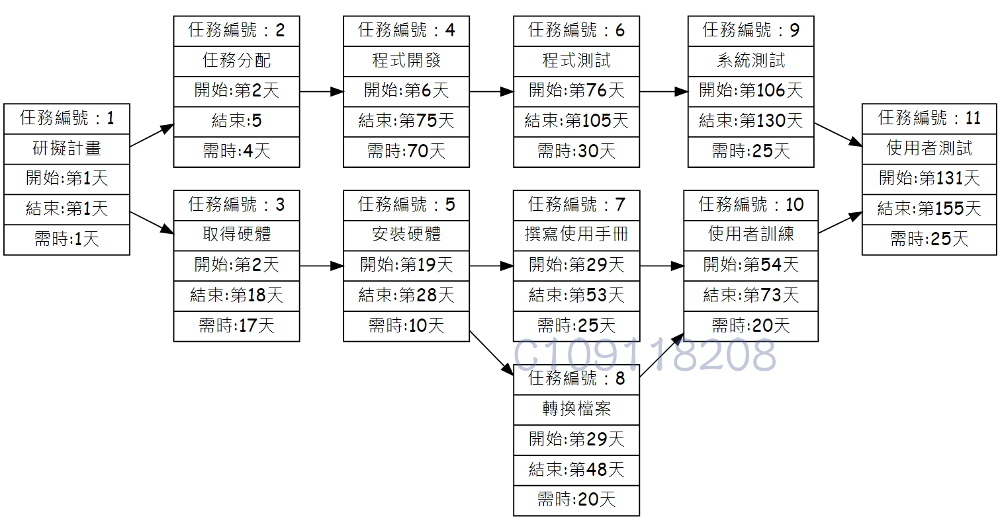
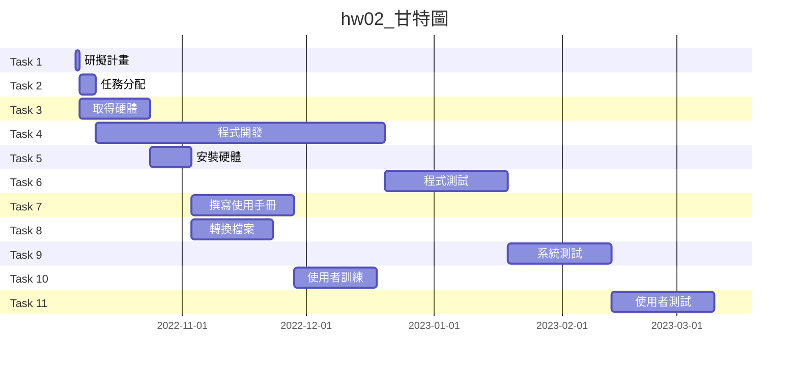

(1) PERT/CRM圖

(2) 甘特圖

```mermaid
gantt
    title hw02_甘特圖
    section Task 1
    研擬計畫:a1, 2022-10-06,1d
    section Task 2
    任務分配:a2, after a1,4d
    section Task 3
    取得硬體:a3, after a1,17d
    section Task 4
    程式開發:a4, after a2,70d
    section Task 5
    安裝硬體:a5, after a3,10d
    section Task 6
    程式測試:a6, after a4,30d
    section Task 7
    撰寫使用手冊:a7, after a5,25d
    section Task 8
    轉換檔案:a8, after a5,20d
    section Task 9
    系統測試:a9, after a6,25d
    section Task 10
    使用者訓練:a10, after a7 a8,20d
    section Task 11
    使用者測試:a11, after a9 a10,25d
```
(3) 關鍵路徑

```mermaid
graph LR
    A(任務1) --> B(任務2) --> C(任務4) --> D(任務6) --> E(任務9) --> F(任務11)
```
